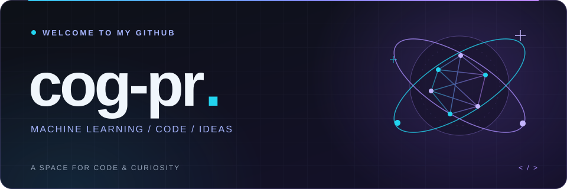

  

  <h1>まを / 中野広翔</h1>

  

    
    
  

  <h3>Language</h3>

  

    
    
    
  

  <h3>GitHub Activity</h3>

  

    
    
  

  

<!-- 装飾: assets/profile-header.svg / assets/profile-footer.svg -->
<!-- バッジ: https://shields.io / 統計カード: https://github.com/stats-organization/github-stats-extended -->
